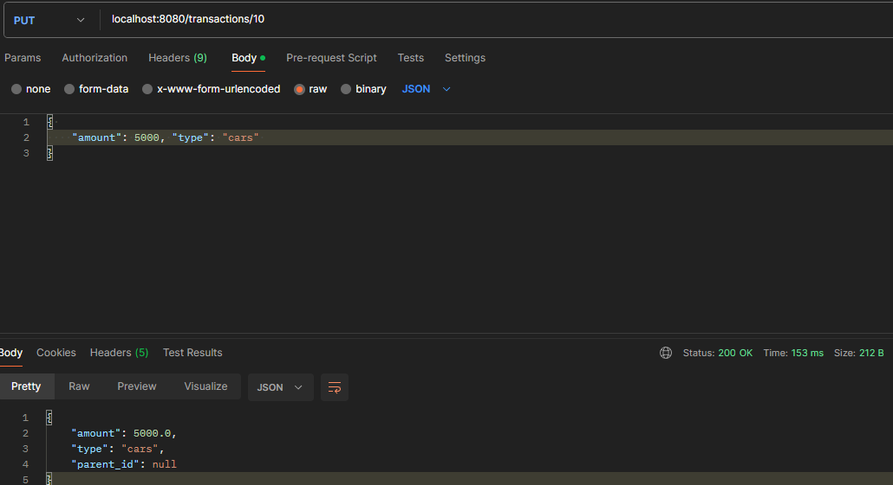

# Mendel Challenge

#### Developer: [Tomas Espinosa](https://www.linkedin.com/in/ttomasespinosa/)

### Prerequisites

- [Docker](https://docs.docker.com/get-docker/)
- [Java 17](https://docs.aws.amazon.com/corretto/latest/corretto-17-ug/what-is-corretto-17.html)
- [Maven 3.9.5](https://maven.apache.org/install.html)
- [Postman](https://www.postman.com/) or similar (Optional)

### Running your application

Open a new terminal, go to the root directory (where the Dockerfile and docker-compose file are located) and execute the following commands:

`docker compose -f docker-compose.dev.yml up --build -d`

After it has finished, execute the following commands to check if the docker image and container were created successfully:

`docker images`

`docker ps`

Now you can send requests with Postman to your containerized application:

### Running your tests
Open a new terminal, go to the root directory (where the Maven and Docker files are located) and execute the following command:

`docker build -t java-docker --target test .`

### Api documentation

You can check our Swagger and Api docs on the following links:

- [Swagger](http://localhost:8080/swagger-ui/index.html#/)

- [Api docs](http://localhost:8080/v3/api-docs)